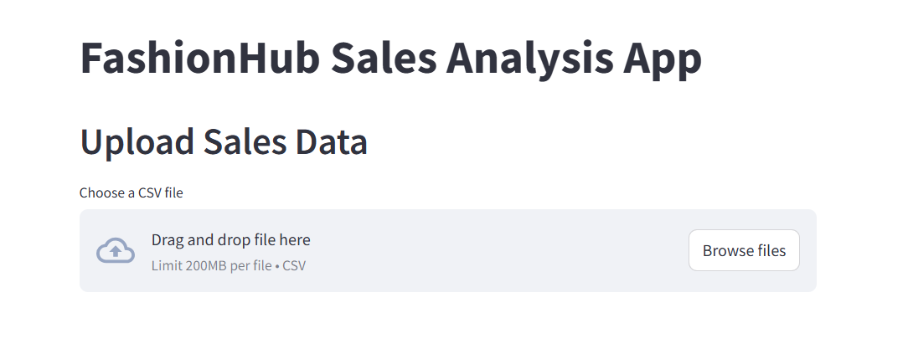
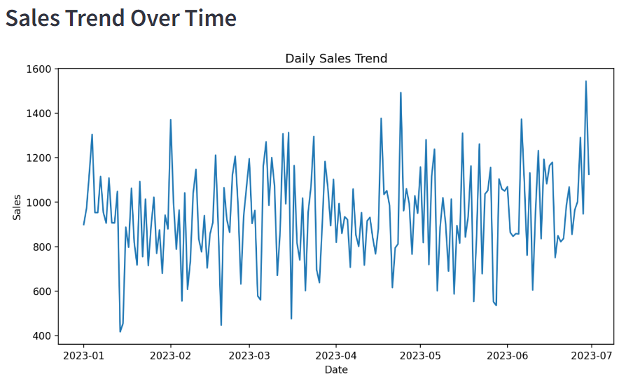
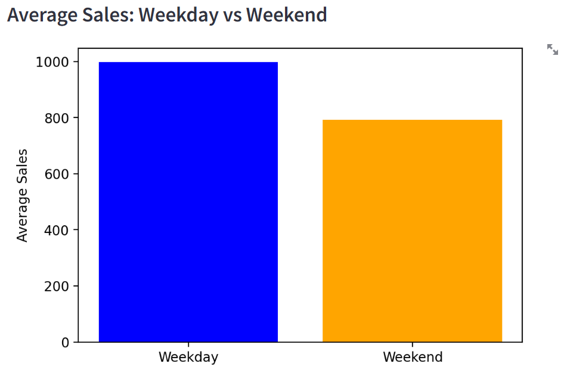

# Declining-Sales-of-FashionHub

# FashionHub Sales Analysis App

## Overview
The **FashionHub Sales Analysis App** is a Streamlit application designed to analyze sales data from a retail chain, focusing on determining whether there is a significant difference in sales between weekdays and weekends. The app provides visualization tools and performs a statistical analysis to help businesses make informed marketing decisions.

## Features
- Upload CSV files containing sales data.
- Visualize sales trends over time and compare average sales between weekdays and weekends.
- Conduct a two-sample t-test to analyze the significance of sales differences.
- Display t-test results and provide actionable business insights.
- Option to download a summary of the analysis as a CSV file.

## Requirements
To run this app, you need to have the following installed:
- Python 3.7 or higher
- Streamlit
- Pandas
- NumPy
- SciPy
- Matplotlib

You can install the required packages using pip:

```bash
pip install streamlit pandas numpy scipy matplotlib

Getting Started
Clone this repository or download the app script (app.py).

Place your sales data CSV file in the same directory.

Open a terminal and navigate to the directory where the app is located.

Run the following command to start the Streamlit app:
streamlit run app.py

## Interface







